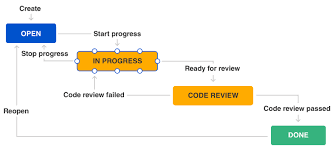

# Project name : <b>Caropedia</b>
## Project Description

The project is a website ( aims to be a a mobile application) that will help people find useful shops for their cars. This website will facilitate the reservation of an appointment at any desired shop according to the needs and possibility of each car owner 

## SCRUM team

| Team   | Name  | Role | Expertise  |
|:---:|---|---|---|
|  Data Science |  Zeina ayman | Data Analyst  | R , Python , SQL , HTML , Javascript , C/C++  |
|   | Laila ehab  | Data Architect | SQL , XML , Hive , Spark  |
|   | Seif Allah | Statistician  | R , SAS , Matlab , SPS  |
| GUI  | Mohamed Sobhi  | Tester  | Git , Java , Python , Ruby |
|   | Jana Sameh | Front-end developer  | Adobe Acrobat , HTML , CSS , Javascript , Wordpress , React , Angular  |
|   |  Hagar Mohamed |  User Experience Developper |   Adobe Acrobat , HTML , CSS , Javascript , Photoshop |
|   General Development | Omar Zaher  | Cloud archtiect  | AWS , Javascript , Python , Java , Azure , GCP  |
|   |  Ezzeldin Abdelzaher | Back-end developer  |  Java, Python, Ruby , MySQL, MongoDB, Oracle, SQLServer ,  Apache, Nginx |
| | Mohamed Wessam  | Full-Stack development  |  HTML , CSS , Javascript  , React , GCP  |
|   |  Ahmed Rafik | Full-Stack development  | HTML , CSS , Javascript , Angular , Azure |

## Stakeholders
- Internal
  1. Mint Incubator : 
 This is a startup incubator which will help us with the initial funding of the project , any poitive or negative change in the project will affect them.
  They are our main fund and the "sponsor" of our project. 

  3. Nile Insurance company : 
 This company will cover the application users both customers and shop owners to recover from any damages in both sides adding credibility 
  to our application. They will be affected by the degree of success or failure of the application and will be invloved in most steps. 

- External
  1. Shop owners
  2. App / Website users

## Product vision
- Near vision: <b> First sprint </b> The product should have payment services fully integrated with the initial designs of the website and <b>Second sprint </b> the search functionality should be fully ready using the required criteria along with a decent sized shop database and the initial server backend and connection with server host
- Far vision : The website should be ready to be released for beta with the search , payment , reservation and messaging systems implemented to at least 2 shop categories that cover a decent area of Cairo
    
## Story points

 We estimate our points using story points not ideal days to better understand how much time we need where according to our usual pace of a work a story point is between <i> a day and a day and a half </i> 

 As a team that worked together before and understand the capability of each member and knows how to work together in harmony we can achieve up to 30 story point per sprint but is also affected by the current situation of the members so we usually work as if we can only take 25 story points per sprint 

- Payment option
- Payment Integration
- Homepage design
- Login / Signup page design
- Shop details page design
- About page design
- Backend creation
- Database creation
- Server hosting
- Car shop search

## Prioirty ordering 

 Our first priority will be to implement the payment system since it is the most crucial and sensitive part of our project , it needs to be done hastly , cleanly and perfectly to avoid any issues. The stakeholders and the customers will need to see the part concerned with their money done first and perfect to further support and help the development process. 
Our second prioirty will be to implement some part of the core service of our project which is to search for the desired shops and find what suits the customer needs and wishes best 

## Work flow

 The work flow I decided to adopt for this project is the general agile workflow since it fits perfectly. We will start working on our project in each sprint till it achieves the acceptance tests. But as additional confirmation we will test every functioanlity implemented at every sprint to make sure the whole website interacts correctly with itself.
Our workflow will always respect the normal vacations and the conditions any team member may pass through and will alwyas try to develop our strategy to work faster and better.

## Important links
Google docs link for the other required documents
- [Daily SCRUM and sprint Documents ](https://docs.google.com/document/d/1S4k9KFKsozDwz3zLr3exy1AbcE3XwpEIcSdEKSuL5PI/edit?usp=sharing)
- [Jira project](https://id.atlassian.com/invite/p/jira-software?id=dterUSilSHenVwoLAeI7DA)
- [Github repo](https://github.com/seifelewa/Agile_task )
